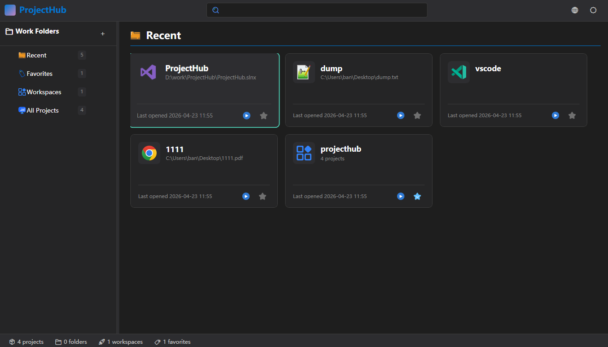

# ProjectHub — 开发者项目管理中心

> 统一管理你的所有项目、工具和工作流，一键启动，告别桌面混乱。

[](https://dotnet.microsoft.com/)
[](https://github.com/dotnet/wpf)
[](https://github.com/dotnet/wpf)
[]()

**[English](../README.md) | 简体中文**

---

## 它解决什么问题？

- 桌面堆满了各种项目文件夹，找个东西要翻半天
- 每次开工要手动打开 IDE、启动调试服务器、打开文档……步骤繁琐
- VS Code、Android Studio、CLion 项目混在一起，没有统一入口
- 常用工具（Postman、数据库客户端）散落在各处
- 多个相关项目需要逐个启动，费时费力

**ProjectHub 将这些全部整合到一个地方** —— 像 JetBrains Toolbox 一样优雅，像 VS Code 一样简洁。

---

## 核心功能

### 多种项目类型，一键启动

不只是代码项目，任何你想快速打开的东西都能管理：

| 类型 | 说明 | 示例 |
|------|------|------|
| **打开文件** | 用系统默认程序或指定程序打开任意文件 | `.sln`、`.csproj`、`.md`、文档 |
| **运行程序** | 直接启动可执行文件 | `Postman.exe`、自定义工具 |
| **打开网页** | 一键打开开发环境、文档站点 | 同时支持多个链接批量打开 |
| **CMD 命令** | 执行预设命令行脚本 | `dotnet run`、`npm start` |

- **智能关联程序检测**：选择文件后自动识别可用打开方式，下拉选择即可
- **自定义启动参数**：为每个项目配置专属参数
- **管理员权限运行**：需要提权的操作一键搞定

### 工作空间 — 项目组合启动

将多个相关项目组织成一个「工作空间」，**一键启动全部**：

- 前端 + 后端 + 数据库客户端，一键开工
- 自由调整项目启动顺序
- 每个项目可独立启用/禁用

### 工作文件夹 — 树形分类管理

- 无限层级文件夹，按业务/客户/技术栈自由归类
- 项目和空间均可拖入文件夹
- 侧边栏树形导航，结构一目了然

### 快速找到你要的

- **全局搜索**：同时搜索项目名称、路径、描述，支持项目和工作空间
- **最近使用**：自动记录打开历史，最近的项目触手可及
- **收藏夹**：常用项目星标收藏，优先展示

### 个性化体验

- **深色 / 浅色主题**：跟随系统或手动切换，护眼舒适
- **中英双语**：一键切换界面语言
- **自定义图标**：为每个项目设置专属图标，快速识别

### 更多贴心细节

- 双击卡片直接启动项目
- 右键菜单：启动 / 收藏 / 编辑 / 打开所在目录 / 删除
- 启动次数和最后打开时间自动统计
- 卡片悬停动效，操作反馈即时
- 项目描述支持，备注项目用途和进度

---

## 界面预览



> 实际截图即将补充，欢迎体验后反馈建议！

---

## 技术栈

| 层级 | 技术 |
|------|------|
| UI 框架 | WPF + .NET 10 |
| 响应式编程 | ReactiveUI |
| 数据持久化 | SQLite + Entity Framework Core |
| 架构模式 | Clean Architecture / DDD |
| 依赖注入 | Microsoft.Extensions.DependencyInjection |
| 对象映射 | AutoMapper |

---

## 快速开始

### 环境要求

- Windows 10 19041 或更高版本
- [.NET 10 SDK](https://dotnet.microsoft.com/download/dotnet/10.0)（运行时即可运行，SDK 用于编译）

### 运行方式

```bash
# 克隆仓库
git clone <仓库地址>
cd ProjectHub

# 编译并运行
dotnet run --project ProjectHub.Presentation.Wpf
```

### 发布为单文件

```bash
dotnet publish ProjectHub.Presentation.Wpf \
  -c Release \
  -r win-x64 \
  --self-contained true \
  -p:PublishSingleFile=true
```

---

## 使用场景

### 场景一：全栈开发者的一天

小明维护着一套微服务系统，每次开工要依次打开：
1. API 网关（VS 项目）
2. 用户服务（VS 项目）
3. 前端管理后台（VS Code 文件夹）
4. Postman（测试工具）
5. 数据库管理工具

**用 ProjectHub**：创建一个「微服务开发」工作空间，将以上 5 个项目按依赖顺序加入。每天早上点击「一键启动」，全部自动打开。

### 场景二：多客户项目管理

小红是外包开发者，同时服务 3 个客户。她将项目按客户放入不同的工作文件夹：

- 客户 A
  - 官网项目
  - 小程序项目
- 客户 B
  - ERP 系统
- 个人项目
  - 开源工具

**用 ProjectHub**：侧边栏树形结构清晰展示，搜索框输入客户名称或技术关键词，秒级定位。

### 场景三：常用工具集散地

小刚的桌面和开始菜单塞满了各种工具：截图软件、录屏软件、格式转换器、设计稿查看器……

**用 ProjectHub**：全部录入为「运行程序」类型项目，一个界面管理所有工具，告别桌面图标灾难。

---

## 路线图

- [x] 项目/工作空间/文件夹管理
- [x] 四种启动方式（文件/程序/网页/CMD）
- [x] 工作空间批量启动
- [x] 全局搜索
- [x] 深色/浅色主题
- [x] 中英文切换
- [ ] 标签系统
- [ ] 垃圾文件清理
- [ ] 全局快捷键 / 托盘图标
- [ ] 配置导入导出
- [ ] 项目模板市场

---

## 参与贡献

欢迎 Issue 和 PR！

- 发现 Bug？请提交 Issue
- 有新功能想法？请开 Discussion
- 想贡献代码？请阅读 [开发指南](../TYLMFiles/DEVELOPMENT_GUIDE.md)

---

## License

MIT License

---

> **ProjectHub** — 让每一次开工，都只需一次点击。
